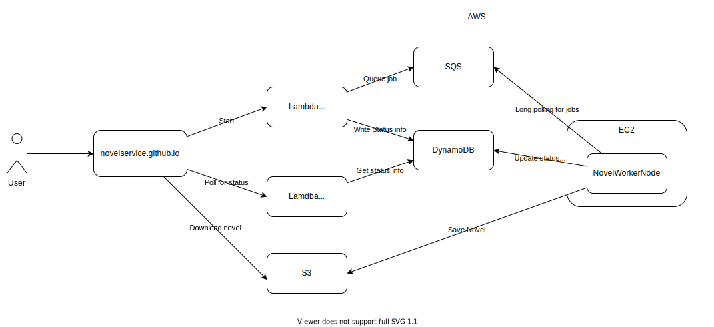

# NovelService
NovelService allows you to download any number of websites as a single ebook.
It currently is still in it's very early stages. Nonetheless it can be accessed on https://novelservice.github.io/ 

I, [XiangRongLin](https://github.com/XiangRongLin), will place the focus of the project not on the functionality, but on the technical site of developing an distributed cloud application. I want it to serve as an example for others on what an potential architecture of an distributed cloud application could look like. I'm mainly a backend developer, so that part of this application will always be better than the frontend.

You can check the [project board](https://github.com/orgs/NovelService/projects/2) to see what I am planning to do next.

# Architecture
Everything is run on AWS' free tier which comes with a set of constraints.
The HTTP API runs on Lambda and is just used to trigger the worker and fetch the status.
The worker continuously polls SQS for new jobs and when receiving one, downloads the website, saves it to S3 and updates the status info with the download url.
That download url is then getting polled by the user and then the user can download the file.

## Constraints
- NovelWorkerNode is deployed inside an EC2 instance with docker compose.
Although the deployment is automated with webhook it still is janky at best.
But EC2 is free for 12 months. ECS was not chosen because it is an Amazon flavoured Kubernetes with an high learning curve (in my opinion) which is better spent on leaning 
Kubernetes.
- SQS only supports polling for messages and not subscribing to messages, but it is always free.  
- Lambda is used because the EC2 instance is already used for the worker. The alternative free compute resource is Lambda, which unfortunately brings a very high cold start latency for Kotlin/JVM. It is already optimized down to 3 seconds from 15 seconds.

# Contributing
At this early stage contributions will be hard to handle because most repositories are still a mess and most importantly missing a CI pipeline with tests.